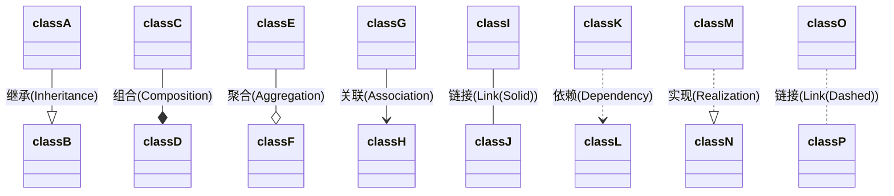

## 语法

```mermaid
classDiagram
classA --|> classB : 继承(Inheritance)
classC --* classD : 组合(Composition)
classE --o classF : 聚合(Aggregation)
classG --> classH : 关联(Association)
classI -- classJ : 链接(Link(Solid))
classK ..> classL : 依赖(Dependency)
classM ..|> classN : 实现(Realization)
classO .. classP : 链接(Link(Dashed))

```

## 参考资料
